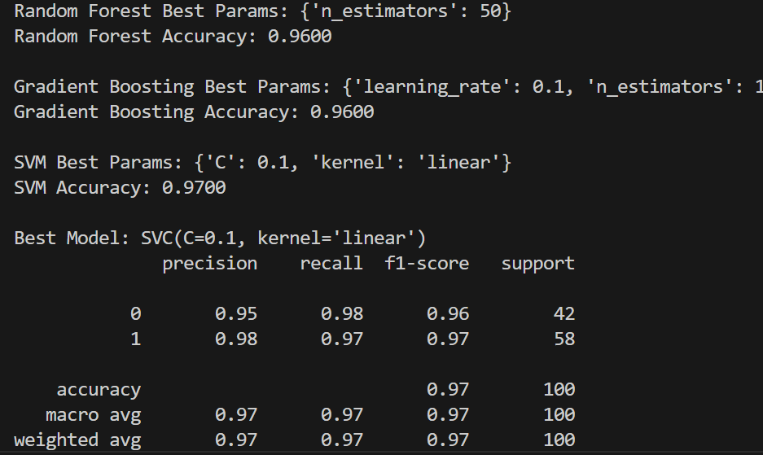

# Gender Classification Using Machine Learning

## 📌 Project Overview

This project builds a machine learning model to classify gender based on facial feature measurements such as forehead width, nose width, nose height, and other attributes.

The objective is to compare multiple machine learning algorithms and identify the best-performing model for accurate classification.

---

## 🎯 Objectives

* Perform data preprocessing and cleaning
* Train multiple machine learning models
* Compare model performance
* Optimize the best model using hyperparameter tuning

---

## 🤖 Algorithms Used

* Random Forest
* Support Vector Machine (SVM)
* Gradient Boosting

The best-performing model is further optimized using **GridSearchCV**.

---

## ⚙️ Project Workflow

1. Data preprocessing and cleaning
2. Label encoding of target variable (gender)
3. Feature scaling using StandardScaler
4. Train-test split
5. Model training with multiple algorithms
6. Model comparison using accuracy
7. Hyperparameter tuning using GridSearchCV
8. Final evaluation using:

   * Classification Report
   * Confusion Matrix

---

## 🛠️ Technologies Used

* Python
* Pandas
* NumPy
* Scikit-learn
* Matplotlib
* Seaborn

---

## 📁 Project Structure

```
gender-classification-ml/
│
├── dataset/
│   └── gender_data.csv
│
├── src/
│   └── train_model.py
│
├── report/
│   └── Gender_Classification_Project.pdf
│
├── README.md
└── requirements.txt
```

---

## 📊 Results

Among all models tested, **Gradient Boosting** achieved the highest accuracy.
Hyperparameter tuning using GridSearchCV further improved performance.

---

### 🔹 Confusion Matrix




## 🚀 Future Improvements

* Use deep learning for image-based classification
* Train on larger datasets
* Deploy as a web application (Flask/Streamlit)

---

## 👩‍💻 Author

**Meghana Reddy Komandla**

🔗 GitHub: https://github.com/MeghanaKomandla
